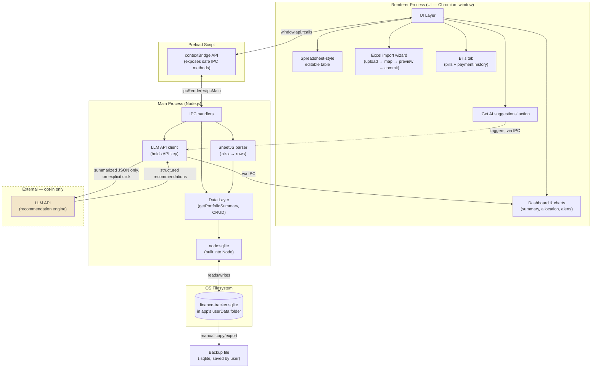

# Finance Tracker — First-Pass Spec

Covers: data model (from your existing Excel), Excel import service, edit UX, the recommendation engine's first version, and the bills & expenses tracker (§7).

---

## 1. Data Model

Mapped directly from your current Excel columns — this is the shape of *one record*, not yet the storage schema (see §1a for the normalized version).

| Field (schema) | Excel column | Type | Notes |
| --- | --- | --- | --- |
| `policyNumber` | Policy No | string | Unique identifier — used to detect duplicates on re-import |
| `instrument` | Instrument | string | e.g. FD, insurance policy, bond |
| `startDate` | Date of taking the policy | date |  |
| `maturityDate` | Maturity Date | date | Drives expiry alerts |
| `termTotal` | Total Term | string/number | Keep as entered (e.g. "5 years") unless you want it normalized to months |
| `institution` | Institution | string |  |
| `branch` | Branch | string |  |
| `holder` | Holder | string |  |
| `jointHolder` | Joint Holder | string, optional |  |
| `nominee` | Nominee | string |  |
| `amountInvested` |  Amount | number | Principal invested |
| `roi` | ROI | number (%) |  |
| `compoundingPeriodsPerYear` | Compounding periods per year | number | 1, 2, 4, 12, etc. |
| `maturityAmount` | Mat Amount | number |  |
| `destinationBank` | Proceeds directed to bank | string | Which bank the proceeds are directed to |
| `destinationAccount` | Expected | string | The specific account at that bank where proceeds land |

Each record also gets an internal `id` (auto-generated, not from Excel) so edits/deletes are reliable even if Policy No is ever missing or reused.

**Note:** `destinationBank` and `destinationAccount` together identify the full proceeds destination (bank + account). `institution` and `branch` (above) identify the *source* — where the investment itself is held.

---

## 1a. Storage: SQLite via Electron's main process, not browser storage

**Why Electron changes the storage plan:** running as a desktop app (Electron) means you get a real Node.js process with real filesystem access — no browser sandbox to work around. That makes the earlier WASM/OPFS plan unnecessary; it existed only to fake persistent SQL storage *inside a browser tab*. With Electron, the **main process** uses **`node:sqlite`** — the SQLite driver built into Node.js (v22+, bundled with current Electron) — directly against a real file on disk. No WASM binary, no Web Worker requirement, no native-module rebuild step.

**Where the data lives:** one `.sqlite` file in the OS's standard per-app data directory, via `app.getPath('userData')`:

- **Windows:** `C:\Users\<you>\AppData\Roaming\portfolio-ledger\`
- **macOS:** `~/Library/Application Support/portfolio-ledger\`
- **Linux:** `~/.config/portfolio-ledger/`

**Process boundary:** only the **main process** opens the database connection. The **renderer** (the UI you actually see and edit) never touches SQLite directly — it calls functions exposed through a `preload` script via `contextBridge`, which send requests over IPC to the main process, which runs the SQL and returns results. This is Electron's standard security model (`contextIsolation: true`, `nodeIntegration: false` in the renderer) and it resolves two things cleanly:

- **Only one database connection ever exists**, regardless of how many windows are open — no multi-tab/multi-connection conflict to design around
- **API keys for the recommendation engine can live in the main process**, never exposed to renderer devtools, since the LLM call is also made main-process-side

**Normalized schema:**

```sql
CREATE TABLE institutions (
  id INTEGER PRIMARY KEY,
  name TEXT NOT NULL,
  branch TEXT,
  UNIQUE(name, branch)
);

CREATE TABLE people (
  id INTEGER PRIMARY KEY,
  name TEXT NOT NULL UNIQUE
);

CREATE TABLE destinations (
  id INTEGER PRIMARY KEY,
  bank TEXT NOT NULL,
  account TEXT NOT NULL,
  UNIQUE(bank, account)
);

CREATE TABLE policies (
  id INTEGER PRIMARY KEY,
  policy_number TEXT UNIQUE,
  instrument TEXT,
  start_date TEXT,
  maturity_date TEXT,
  term_total TEXT,
  amount_invested REAL,
  roi REAL,
  compounding_periods_per_year INTEGER,
  maturity_amount REAL,
  institution_id INTEGER REFERENCES institutions(id),
  holder_id INTEGER REFERENCES people(id),
  joint_holder_id INTEGER REFERENCES people(id),
  nominee_id INTEGER REFERENCES people(id),
  destination_id INTEGER REFERENCES destinations(id)
);
```

`institutions`, `people`, and `destinations` are all lookup tables — on import, a name/bank+account not already present gets inserted once and reused by every policy that references it (via `UNIQUE` constraints, so duplicates can't silently creep in). One `people` table covers holders, joint holders, and nominees, since the same person can appear in any of those roles across different policies.

---

## 1b. Display currency

Amounts are stored as plain numbers with no currency attached. A single
app-wide **display currency** (INR by default; USD, EUR, GBP, AED, SGD, AUD,
CAD) decides how they're shown, including in reminder emails. It's stored in
`settings` under `currency`. Switching it relabels amounts without converting
them, and each currency uses its English-locale number format (INR keeps lakh
grouping). Holding accounts in more than one currency would need a currency
per policy and bill, which is still a stretch goal (roadmap Phase 5).

---

## 2. Excel Import Service (initial load + re-import)

**Goal:** upload the existing Excel once to seed the app, and allow re-uploading later (e.g. after editing the sheet in parallel) without creating duplicates.

**Flow:**

1. **Upload** — drag-and-drop or file picker, accepts `.xlsx`/`.xls` (parsed client-side with SheetJS — no data leaves the browser).
2. **Auto-map columns** — match Excel headers to schema fields by name; show a mapping screen only for anything that doesn't match automatically, with a manual dropdown to correct it.
3. **Preview & validate** — show parsed rows in a table before committing. Flag rows with:
   - missing required fields (Policy No, Institution, Amount Invested, Maturity Date)
   - unparseable dates or non-numeric amounts/ROI
   - Invalid rows are shown inline, editable right there, not silently dropped.
4. **Duplicate handling** — match on `policyNumber` for the policy row itself. If a row's Policy No already exists, show a diff (old vs. new per field) and let the user choose **Skip / Overwrite / Merge**, per row or applied to all. Separately, for each institution/person/destination referenced in a row: look it up by exact match against the relevant lookup table; if not found, create it. (A "did you mean X?" fuzzy-match nudge for near-matches — e.g. "HDFC" vs "HDFC Bank" — is worth adding once the basic import works, to catch typos before they create duplicate lookup entries.)
5. **Commit** — write to IndexedDB. Show an import summary: *"14 added, 2 updated, 1 skipped, 0 errors."*

**Why this shape:** since Excel stays your possible parallel source of truth for a while, re-import needs to be safe to run repeatedly — not just a one-time migration.

---

## 3. Edit UX

Given you're coming from Excel, the primary view should behave like a lightweight spreadsheet rather than a form-per-record:

- **Inline-editable table** — click a cell, edit in place, autosave on blur (no separate "Save" button/mode).
- **Add row** button at the bottom; **delete row** via a trash icon per row (with a confirm, since there's no undo yet in early phases).
- **Sortable columns** (click header) and a **quick filter** bar (by institution, holder, or free text across all fields).
- **Inline validation** — invalid cells (bad date, non-numeric ROI, etc.) highlight in place rather than blocking the whole save.
- A **detail/expanded view** per row is optional for later — only add it if the table gets visually cramped with all 16 columns on smaller screens.

This edit view is really Phase 1's "list view" from the roadmap, upgraded to be spreadsheet-like instead of a plain read-only table — worth building it this way from the start rather than retrofitting later.

---

## 4. Recommendation Engine — v1 Spec

**Trigger:** explicit "Get AI suggestions" button. Never runs automatically or on a schedule.

**Input sent to the model** — a *summarized* JSON object, not raw rows with names attached:

```json
{
  "totalInvested": 4250000,
  "accountCount": 14,
  "byInstitution": [
    { "institution": "HDFC", "totalAmount": 1200000, "count": 3, "avgROI": 6.8 },
    { "institution": "SBI", "totalAmount": 900000, "count": 2, "avgROI": 6.2 }
  ],
  "upcomingMaturities": [
    { "policyNumber": "FD-2291", "maturityDate": "2026-11-03", "amount": 300000, "institution": "HDFC" }
  ],
  "roiRange": { "min": 5.5, "max": 8.1, "avg": 6.9 }
}
```

Holder/nominee/branch names are left out of what's sent unless a specific recommendation genuinely needs them — the aggregates above are enough for most useful suggestions.

**Output — structured, not free text:**

```json
{
  "recommendations": [
    {
      "type": "reinvestment",
      "priority": "high",
      "relatedPolicyNumbers": ["FD-2291"],
      "message": "FD-2291 matures in 12 days. Current rates at this institution are below your portfolio average — compare before auto-renewal."
    },
    {
      "type": "concentration",
      "priority": "medium",
      "relatedPolicyNumbers": [],
      "message": "28% of your portfolio sits with one institution. Consider whether that concentration is intentional."
    }
  ]
}
```

**v1 recommendation types to start with** (keep the scope narrow):

- **Upcoming maturity** — flag anything maturing within N days (configurable, default 30)
- **Underperformance** — accounts with ROI meaningfully below your portfolio average
- **Concentration** — a large share of funds in one institution
- Leave diversification-by-instrument-type, tax-efficiency, and reinvestment-timing suggestions for a v2 once the basic loop is working

**Guardrails:**

- System prompt instructs the model to reason only from the JSON provided — never invent figures or reference accounts not in the input
- Every recommendation must cite the `relatedPolicyNumbers` it's based on, so you can trace it back to your data
- No generic "financial advice" language — frame outputs as observations about *this* data, not investment advice
- Show a small "sent to AI" indicator each time the button is used, listing what was included, so it's never a silent network call

---

## 5. Architecture Diagram



**Reading the diagram:**

- **Renderer** (what you see) never touches the database or the LLM API directly — it only calls methods exposed by the **preload script**, which forwards requests over Electron's IPC to the **main process**. This is Electron's standard security boundary (`contextIsolation: true`, `nodeIntegration: false`).
- The **main process** is where all real work happens: it owns the single SQLite connection (via `node:sqlite`), parses uploaded Excel files, and — only when the user clicks "Get AI suggestions" — calls the LLM API, keeping the API key out of the renderer entirely.
- The **database file** sits in the OS's standard per-app data folder (see §1a for exact paths per OS) — a real file you can back up by copying it directly, in addition to any in-app export.
- The **LLM API** is the only component that leaves the machine, and only on explicit request (dashed border = opt-in, not part of the core loop).

---

## 6. Packaging & Distribution

Once the app works in development (`electron .` / `npm run dev`), it needs to be packaged into an actual installable app:

- **Tool:** Electron Forge or `electron-builder` — either produces a native installer per OS (`.exe`/NSIS for Windows, `.dmg` for macOS, `.AppImage`/`.deb` for Linux)
- **First run:** the app creates its `userData` folder and initializes an empty database (with the schema from §1a) if none exists yet — no separate "setup" step needed
- **Updates:** for a personal single-user app, manual reinstall-on-update is simplest; auto-update infrastructure is worth skipping unless this ever needs to run on more than your own machine

---

## 7. Bills & Expenses Tracker

**Goal:** keep track of recurring bills, expenses and items (rent, electricity,
insurance premiums, …): what's due when, how each is paid, and a permanent
record of every payment so past payments can be looked up.

**Where it lives:** its own **Bills** tab, next to Portfolio and Tax
projection. It shares the same SQLite database, backup/restore and
`DB_RESET` behaviour (a reset clears bills and payments along with policies).

### 7a. Data model

A **bill** is anything paid on a schedule:

| Field | Type | Notes |
| --- | --- | --- |
| `name` | string | e.g. "Electricity" — required |
| `frequency` | enum | `monthly`, `bimonthly` (every 2 months), `quarterly`, `semiannual` (every 6 months), `annual` — defaults to monthly |
| `paymentMethod` | enum | `bank_transfer` (direct bank payment), `check` (check deposit) or `credit_card` |
| `bankDetail` | string | Bank/account or card for the payment — **required for a check deposit**, optional for a bank payment or credit card (which card) |
| `dueDate` | date | The **next** due date |
| `amount` | number, optional | The usual amount. Blank for bills that vary between periods; the amount actually paid is always entered per payment |
| last payment | derived | Most recent payment's date and amount — read from the history, not stored on the bill, so the two can't disagree |

A **payment** is a new row every time, never overwritten:

| Field | Type | Notes |
| --- | --- | --- |
| `paidOn` | date | Required |
| `amount` | number | Required, > 0 — what was actually paid this period. Prefilled from the bill's usual amount, or for a bill that varies, its last payment |
| `paymentMethod`, `bankDetail` | as above | Copied from the bill when recording (editable), so history stays accurate if the bill's method changes later |
| `forDueDate` | date | The due date this payment settled |
| `note` | string, optional | e.g. cheque number or reference |

```sql
CREATE TABLE bills (
  id INTEGER PRIMARY KEY,
  name TEXT NOT NULL,
  frequency TEXT NOT NULL DEFAULT 'monthly'
    CHECK (frequency IN ('monthly', 'bimonthly', 'quarterly', 'semiannual', 'annual')),
  payment_method TEXT NOT NULL CHECK (payment_method IN ('bank_transfer', 'check', 'credit_card')),
  bank_detail TEXT,
  due_date TEXT NOT NULL,    -- next due date
  due_day INTEGER NOT NULL,  -- day of month it falls due (1–31)
  amount REAL,               -- usual amount; NULL when it varies
  archived_at TEXT           -- archived bills keep their history
);

CREATE TABLE bill_payments (
  id INTEGER PRIMARY KEY,
  bill_id INTEGER NOT NULL REFERENCES bills(id),
  paid_on TEXT NOT NULL,
  amount REAL NOT NULL,
  payment_method TEXT NOT NULL CHECK (payment_method IN ('bank_transfer', 'check', 'credit_card')),
  bank_detail TEXT,
  for_due_date TEXT,
  note TEXT,
  created_at TEXT NOT NULL DEFAULT (datetime('now'))
);
```

### 7b. Behaviour

- **Recording a payment** inserts a `bill_payments` row and, in the same
  transaction, moves `due_date` on by the bill's frequency. The user can untick
  that for a one-off payment.
- **Due dates keep their day of month:** `due_day` remembers the original day,
  so a bill due on the 31st goes 31 Jan → 28 Feb → 31 Mar rather than drifting
  to the 28th.
- **Archive, don't delete:** archiving hides a bill but keeps it and its
  history; it can be restored. A single payment entered by mistake can be
  deleted (the due date is left as it is).
- **Summary tiles:** bill count; average paid from the bank per month (amount ÷
  months per period, so a ₹12,000 yearly bill counts as ₹1,000; a bill with no
  usual amount counts at its last payment, and one never paid isn't counted).
  Only bills whose usual method is `bank_transfer` or `check` count: a
  `credit_card` bill is charged to the card, and the card's own bill (paid from
  the bank) is what leaves the account, so counting both would double-count.
  Card bills' monthly total is shown separately in the tile's note.
- **Paid from bank this month:** the same rule applied to the payment history:
  payments this calendar month whose recorded method is `bank_transfer` or
  `check`. It goes by each payment's own method rather than the bill's, since a
  single period can be paid differently; card payments are totalled separately
  in the note.
- **Overdue** and **due within 7 days** cover all bills, cards included, since
  they're about what needs paying rather than what leaves the bank.
- **Upgrading older databases:** SQLite can't change a NOT NULL or CHECK
  constraint in place, so on startup the bills tables are rebuilt from the
  current definitions when they're out of date (e.g. created before credit
  card was a payment method), keeping ids and every payment.
- **Variable amounts:** a bill's usual amount is optional. Reminder emails show
  "Varies" with the last payment for reference.
- **Payment history** lists every payment newest first, filterable by bill.

### 7c. Email reminders

Bill reminders are an option of the existing email reminders (off by default):
**Also remind me when bills are due**, with their own **days before** list
(default 3 and 1, since bills come round far more often than maturities). The
daily check puts due bills into the same digest email as maturing policies,
in a separate table. A `bill_reminder_log (bill_id, due_date, days_before)`
table records what was sent, so each threshold goes out once per due date;
paying a bill moves its due date on, which starts the next cycle, and a bill
paid before its reminder is never reminded. Overdue bills aren't reminded.

### 7d. Possible next steps

- A reminder for bills that go overdue unpaid
- Variable bills: suggest the amount from an average of the last few payments, rather than just the last one
- Yearly spend per bill and a chart of spending by month

---

## Suggested build order for this slice

1. Finalize the `expected` field's meaning — ✅ done (destination bank/account, see §1)
2. Scaffold the Electron app (main + preload + renderer) with `node:sqlite` initialized against the schema in §1a
3. Excel import (upload → preview → commit) — this becomes your fastest path to a usable app, since your real data drops straight in
4. Inline-editable table view
5. Recommendation engine v1, using the three recommendation types above (§4)
6. Package for distribution (§6)
7. Bills & expenses tracker (§7)